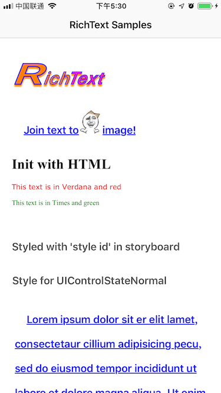

## RichText

[](https://travis-ci.org/cheng4741@qq.com/RichText)
[](http://cocoapods.org/pods/RichText)
[](http://cocoapods.org/pods/RichText)
[](http://cocoapods.org/pods/RichText)




`RichText` is a light weight wrapper of `NSAttributedString`, instead of attributes dictionary, RichText using block chains. RichText provides lots of block to style, append, match text.

Let's create a simple richtext like the follow, numders set to red color, the last 3 characters set to bold font：

#### Traditional way

```objectivec
    NSMutableAttributedString * attrStr = [[NSMutableAttributedString alloc]
                                           initWithString:@"恭喜你获得50金币，以及10元现金奖励，可提现"];
    [attrStr addAttribute:NSFontAttributeName
                    value:[UIFont systemFontOfSize:14]
                    range:NSMakeRange(0, attrStr.length)];
    NSError *err = nil;
    NSRegularExpression *regExp = [NSRegularExpression
                                   regularExpressionWithPattern:@"\\d"
                                   options:NSRegularExpressionCaseInsensitive
                                   error:&err];
    NSAssert(err == nil, err.localizedDescription);
    [regExp enumerateMatchesInString:attrStr.string
                             options:NSMatchingReportCompletion
                               range:NSMakeRange(0, attrStr.length)
                          usingBlock:^(NSTextCheckingResult * _Nullable result,
                                       NSMatchingFlags flags, BOOL * _Nonnull stop) {
        if (result.range.location != NSNotFound) {
            [attrStr addAttribute:NSForegroundColorAttributeName
                            value:UIColor.redColor
                            range:result.range];
        }
    }];
    [attrStr addAttribute:NSFontAttributeName
                    value:[UIFont boldSystemFontOfSize:14]
                    range:NSMakeRange(attrStr.length - 3, 3)];
    
```

#### Smart way

```objectivec
@"恭喜你获得50金币，以及10元现金奖励，可提现"
    .setFont(UIFont.regular(14))
    .matches(@"\\d")//选中数字
    .setColor(UIColor.redColor)//设置颜色
    .last(3)//选中最后3个
    .setFont(UIFont.bold(14));
```

## How to use

There are three import protocols in RTText, in these protocols's  cooperation, handing our richtext become easy.

* RTText protocol（an adapter between RTText and other type）
* RTRangeable protocol（change the range the follow-up operation will take effect）
* RTStyleable protocol（style the text，such as color, font, shadow ...）

Create a richtext with 2 steps:

1. Select a range you'd like to be handed with the methods in `RTRangeable`
2. Add styles to the range with the methods in `RTStyleable`

```objectivec
@"RichText"
    .setColor(UIColor.magentaColor) //设置颜色
    .setStrokeColor(UIColor.blueColor) // 设置描边颜色
    .setStrokeWidth(-3) // 设置描边宽度
    .setShadow(shadow) // 设置阴影
    .rangeTo(4) // 选中范围
    .setColor(UIColor.orangeColor) // 给前4个设置颜色
    .matches(@"R") // 匹配指定范围
    .setExpansion(0.5) // 拉伸或压缩
```

NSAttributedString, NSString and RTText implemented all of above protocols, they can convert to each other at most time. two ways at bellow is equality:

```objectivec
    self.label.attributedText = @"RichText"
    .setKern(1) //设置字间距
    .setColor(UIColor.magentaColor)
    .attributedString;
```

```objectivec
    self.label.richText = @"RichText"
    .setKern(1) //设置字间距
    .setColor(UIColor.magentaColor);
```

UIImage implements RTText protocol also, you can insert a image to richtext conveniently, but you can not style a image. 

```
    UIImage *image = [UIImage imageNamed:@"smile"].withSize(80,80);
    self.label2.richText = @"richtext"
                            .join(image)
                            .setStyle(style2);
```

## Example

To run the example project, clone the repo, and run `pod install` from the Example directory first.

## Installation

RichText is available through [CocoaPods](http://cocoapods.org). To install
it, simply add the following line to your Podfile:

```ruby
pod 'RichText'
```

## Author

bingcheng.zhu@qq.com

## License

RichText is available under the MIT license. See the LICENSE file for more info.
